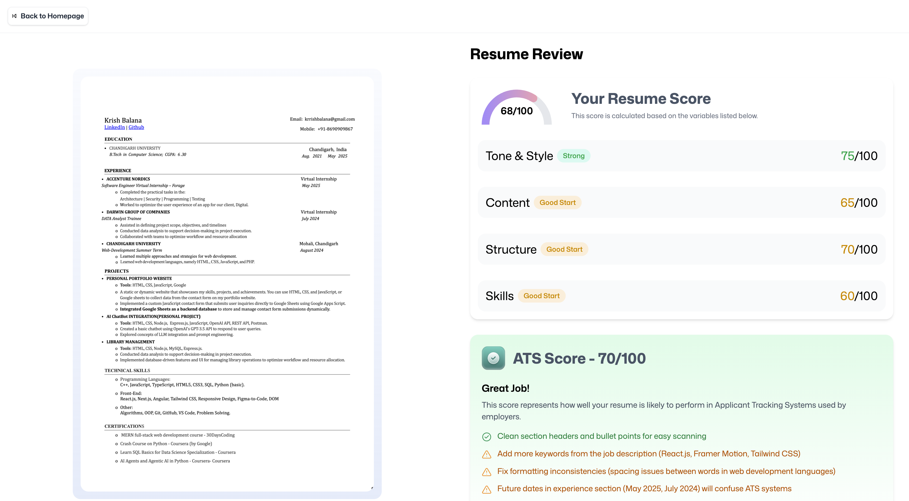

# Resume AI Feedback Analyzer

A full-stack web app that analyzes resumes using AI to provide smart ATS feedback and improvement tips based on the job role and description provided.



## 🚀 Features

- Upload resume as PDF
- Converts PDF to image for AI visualization
- Gets AI-powered feedback on resume tailored to job title & description
- Smart ATS score and improvement tips
- Modern responsive UI

## 🧰 Tech Stack

- **Frontend**: React, TypeScript, Tailwind CSS
- **Backend**: Puter SDK (FS, KV, AI modules)
- **AI**: OpenAI-powered resume analysis
- **PDF Handling**: `pdfjs-dist` to render and convert PDFs

---

## 🛠️ How to Run the Project Locally

### 1. Clone the Repo

```bash
git clone https://github.com/krishbalana/resume-ai-feedback.git
cd resume-ai-feedback
```

### 2. Install Dependencies

```bash
npm install
```

### 3. Setup `.env` (If required)

If the project needs environment variables (for API keys, Puter SDK, etc.), create a `.env` file like:

```bash
VITE_PUTER_API_KEY=your_key_here
```

> _Note: Check the project for `.env.example` if available._

### 4. Start the App

```bash
npm run dev
```

Visit `http://localhost:5173` in your browser.

---

## 📁 Folder Structure

```
├── app/
│   ├── components/
│   ├── lib/
│   ├── routes/
│   ├── public/
│   └── ...
├── constants/
├── public/
│   └── images/
├── README.md
└── ...
```

---

## ✨ How It Works

1. User uploads a resume (PDF)
2. PDF is converted to an image using `pdfjs-dist`
3. File & image are uploaded via `fs.upload` (Puter)
4. AI is triggered via `ai.feedback()` with job title + description
5. Resume feedback is stored in `kv` store
6. User is redirected to result page with analysis

---

## 📦 Deployment

You can deploy it to platforms like:

- **Vercel** (Recommended for frontend)
- **Netlify**
- **Render** (if you need server features)
- Make sure to include necessary env variables in production.

---

Made with ❤️ by [Krish Balana](https://github.com/krishbalana)
